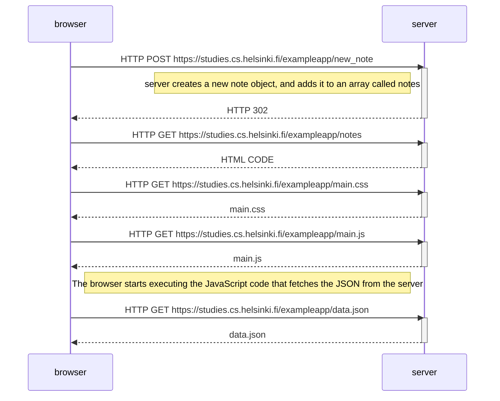

```mermaid
sequenceDiagram
    participant browser
    participant server

    browser->>server: HTTP POST https://studies.cs.helsinki.fi/exampleapp/new_note
    activate server
    Note left of server: server creates a new note object, and adds it to an array called notes
    server-->>browser: HTTP 302
    deactivate server
    browser->>server: HTTP GET https://studies.cs.helsinki.fi/exampleapp/notes
    activate server
    server-->>browser: HTML CODE
    deactivate server
    browser->>server: HTTP GET https://studies.cs.helsinki.fi/exampleapp/main.css
    activate server
    server-->>browser: main.css
    deactivate server
    browser->>server: HTTP GET https://studies.cs.helsinki.fi/exampleapp/main.js
    activate server
    server-->>browser: main.js
    deactivate server
    Note right of browser: The browser starts executing the JavaScript code that fetches the JSON from the server
    browser->>server: HTTP GET https://studies.cs.helsinki.fi/exampleapp/data.json
    activate server
    server-->>browser: data.json
    deactivate server
```
