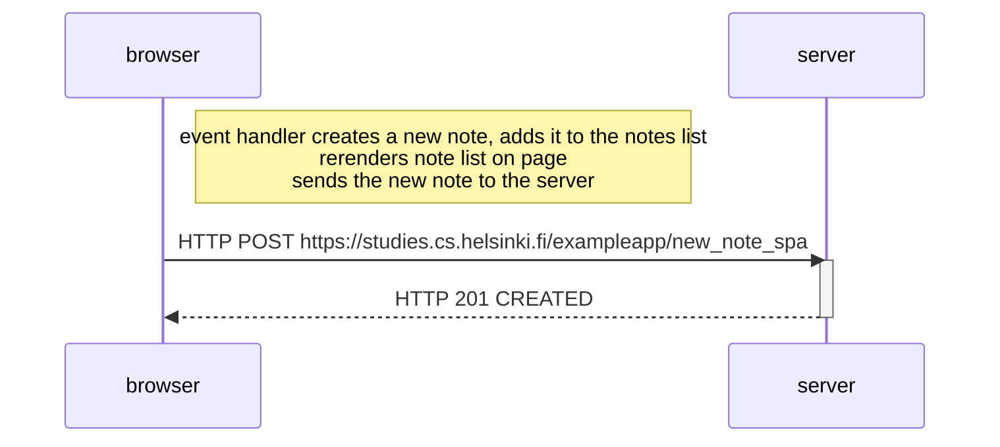

```mermaid
sequenceDiagram
    participant browser
    participant server

    Note right of browser: event handler creates a new note, adds it to the notes list<br/>rerenders note list on page <br/>sends the new note to the server
    browser->>server: HTTP POST https://studies.cs.helsinki.fi/exampleapp/new_note_spa
    activate server
    server-->>browser: HTTP 201 CREATED
    deactivate server
```
